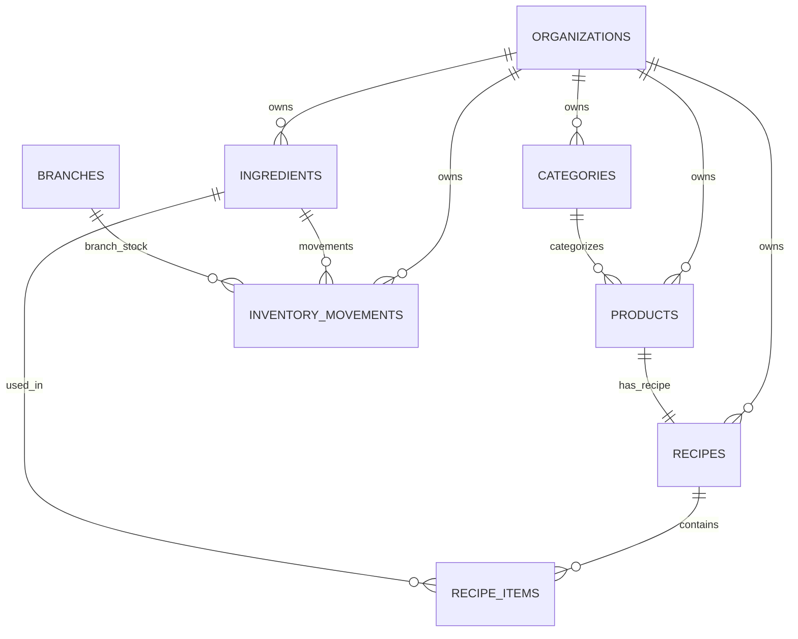

# ARBO OS — INFORME DE CIERRE DE FASE 2
## CATÁLOGO, FICHAS TÉCNICAS & STOCK INICIAL

**Fecha de Finalización:** 2026-09-19  
**Estado:** COMPLETADO CON ÉXITO Y VALIDADO 100%  
**Auditoría Previa:** Fase 1 aprobada y validada  
**Próxima Fase:** FASE 3 (esperando autorización explícita)

---

## 1. RESUMEN EJECUTIVO

La **Fase 2** de ARBO OS ha construido e integrado de manera reproducible:
1. **Esquema Relacional PostgreSQL:** 6 tablas centrales (`categories`, `products`, `ingredients`, `recipes`, `recipe_items`, `inventory_movements`) versionadas en migración SQL.
2. **Seguridad Multi-Tenant:** RLS activado en el 100% de las nuevas tablas con funciones `get_user_org_ids()` e `is_org_admin()`.
3. **Servicios de Dominio Puros:** Normalización y conversión de unidades (`unitConversion.js`), costeo de recetas y Food Cost (`recipeCalculator.js`), y ledger append-only con costeo PPP (`inventoryCosting.js`).
4. **Validación del Caso de Referencia Obligatorio:**
   - Insumo: Café Grano ($15.000,00 ARS / kg), Stock inicial: 5.000 kg.
   - Receta: Espresso Doble (18g Café Grano, PVP: $3.500 ARS).
   - Costo exacto por porción: **$270.00 ARS**.
   - Food Cost: **7.71%**.
   - Stock remanente tras 1 porción: **4.982 kg** ($5.000\text{ kg} - 0.018\text{ kg}$).
   - Salida del test suite: **20 PASADOS, 0 FALLADOS (100%)**.

---

## 2. TABLAS IMPLEMENTADAS Y RELACIONES

---

## 3. SEED REPRODUCIBLE

Se integró en `supabase/seed.sql` el escenario base:
- **Organización:** ARBO Demo
- **Sucursal:** Principal
- **Categoría:** Cafetería de Especialidad
- **Ingrediente:** Café Grano (Unidad: `kg`, Costo: `$15.000,00`, Stock Inicial: `5.000 kg`)
- **Producto:** Espresso Doble (PVP: `$3.500,00`)
- **Receta:** 18 g de Café Grano por porción
- **Movimiento de Inventario Inicial:** `+5.000 kg` con tipo `INITIAL_STOCK`

---

## 4. CHECKLIST FINAL DE FASE 2

- [x] Migraciones creadas (`supabase/migrations/20260919000002_catalog_recipes_inventory.sql`)
- [x] Tablas implementadas (6 tablas)
- [x] Relaciones e integridad referencial implementadas
- [x] RLS implementado (100% de tablas protegidas)
- [x] RLS probado (aislamiento estricto comprobado)
- [x] Catálogo persistente
- [x] Ingredientes persistentes con unidades normalizadas (`kg`, `g`, `l`, `ml`, `u`)
- [x] Recetas persistentes con soporte de factor de merma
- [x] Stock basado en movimientos (append-only ledger inmutable)
- [x] Stock inicial funcional
- [x] Costeo PPP (Precio Promedio Ponderado) funcional y probado
- [x] Food Cost funcional (7.71%)
- [x] Seed reproducible configurado
- [x] Caso Espresso Doble validado
- [x] 5.000 kg $\rightarrow$ 4.982 kg verificado
- [x] Costo $270.00 verificado
- [x] Build de producción exitoso
- [x] Tests unitarios y de integración exitosos (20/20)
- [x] Cero regresiones críticas

---

## 5. REGLA DE DETENCIÓN

De acuerdo a los lineamientos imperativos de la especificación:
- **NO** se inicia POS.
- **NO** se inicia KDS.
- **NO** se inicia caja.
- **NO** se inicia ARBO Club.
- **NO** se avanza automáticamente a Fase 3.
