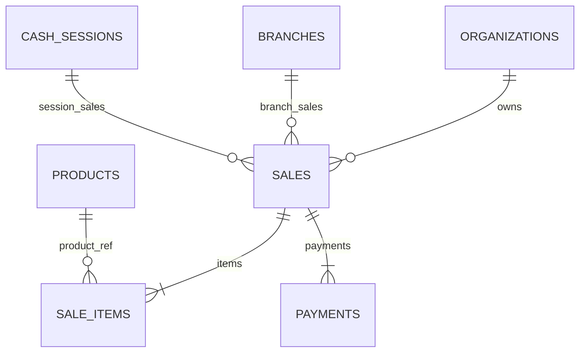

# ARBO OS — FASE 3: ESQUEMA DE DATOS DE VENTAS Y PAGOS

---

## 1. MODELO RELACIONAL DE VENTAS

La venta se divide en tres niveles estructurales:
1. **Cabecera (`sales`):** Contexto organizacional, estado operativo, auditoría y montos consolidados.
2. **Detalle (`sale_items`):** Líneas de artículos con preservación de instantáneas (snapshots).
3. **Cobro (`payments`):** Evidencia de pago vinculada a la sesión de caja activa.



---

## 2. ESPECIFICACIÓN DDL

### 2.1 `sales`
```sql
CREATE TABLE public.sales (
    id UUID PRIMARY KEY DEFAULT gen_random_uuid(),
    organization_id UUID NOT NULL REFERENCES public.organizations(id) ON DELETE CASCADE,
    branch_id UUID NOT NULL REFERENCES public.branches(id) ON DELETE CASCADE,
    cash_session_id UUID REFERENCES public.cash_sessions(id) ON DELETE SET NULL,
    sale_number BIGINT NOT NULL,
    status VARCHAR(20) NOT NULL DEFAULT 'PAID' CHECK (status IN ('DRAFT', 'CONFIRMED', 'PAID', 'CANCELLED')),
    subtotal NUMERIC(12, 2) NOT NULL CHECK (subtotal >= 0),
    discount_amount NUMERIC(12, 2) NOT NULL DEFAULT 0.00 CHECK (discount_amount >= 0),
    total NUMERIC(12, 2) NOT NULL CHECK (total >= 0),
    notes TEXT,
    created_by UUID REFERENCES public.user_profiles(id) ON DELETE SET NULL,
    created_at TIMESTAMPTZ NOT NULL DEFAULT clock_timestamp(),
    updated_at TIMESTAMPTZ NOT NULL DEFAULT clock_timestamp(),
    UNIQUE (organization_id, branch_id, sale_number)
);
```

### 2.2 `sale_items`
Garantiza el principio de **inmutabilidad histórica**:
- Si el precio del producto sube en el catálogo mañana, las ventas pasadas retienen el valor comercial al momento del cobro.
```sql
CREATE TABLE public.sale_items (
    id UUID PRIMARY KEY DEFAULT gen_random_uuid(),
    sale_id UUID NOT NULL REFERENCES public.sales(id) ON DELETE CASCADE,
    product_id UUID NOT NULL REFERENCES public.products(id) ON DELETE RESTRICT,
    product_name_snapshot VARCHAR(255) NOT NULL,
    quantity NUMERIC(12, 4) NOT NULL CHECK (quantity > 0),
    unit_price_snapshot NUMERIC(12, 2) NOT NULL CHECK (unit_price_snapshot >= 0),
    subtotal NUMERIC(12, 2) NOT NULL CHECK (subtotal >= 0),
    created_at TIMESTAMPTZ NOT NULL DEFAULT clock_timestamp()
);
```

### 2.3 `payments`
```sql
CREATE TABLE public.payments (
    id UUID PRIMARY KEY DEFAULT gen_random_uuid(),
    organization_id UUID NOT NULL REFERENCES public.organizations(id) ON DELETE CASCADE,
    branch_id UUID NOT NULL REFERENCES public.branches(id) ON DELETE CASCADE,
    sale_id UUID NOT NULL REFERENCES public.sales(id) ON DELETE CASCADE,
    cash_session_id UUID REFERENCES public.cash_sessions(id) ON DELETE SET NULL,
    payment_method VARCHAR(30) NOT NULL DEFAULT 'CASH' CHECK (payment_method IN ('CASH')),
    amount NUMERIC(12, 2) NOT NULL CHECK (amount > 0),
    cash_tendered NUMERIC(12, 2) CHECK (cash_tendered >= amount),
    change_given NUMERIC(12, 2) CHECK (change_given >= 0),
    created_at TIMESTAMPTZ NOT NULL DEFAULT clock_timestamp()
);
```

---

## 3. ESTADOS DE UNA VENTA

| Estado | Significado Operativo | Impacto en Stock | Impacto en Caja |
| :--- | :--- | :---: | :---: |
| `DRAFT` | Orden en borrador o mesa abierta | Sin impacto | Sin impacto |
| `CONFIRMED` | Comanda confirmada y enviada a cocina | Reservado o pendiente | Sin impacto |
| `PAID` | Venta cobrada y finalizada | **Consumo registrado** (`SALE_DEPLETION`) | **Ingreso registrado** (`SALE`) |
| `CANCELLED` | Venta anulada | Reversión compensatoria | Reversión compensatoria |
