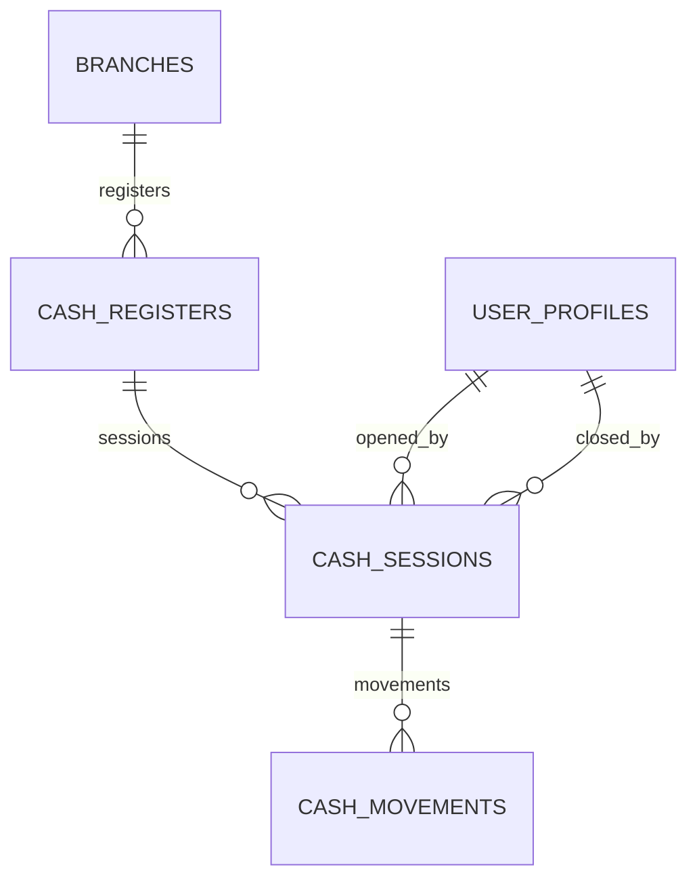

# ARBO OS — FASE 3: ESQUEMA DE CAJA Y LIBRO MAYOR (APPEND-ONLY)

---

## 1. EL MODELO DE CAJA DE 3 CAPAS

Para solucionar la vulnerabilidad identificada en la auditoría forense del prototipo (donde abrir una caja borraba el historial en memoria con `movements: []`), ARBO OS adopta la arquitectura de 3 capas:

$$\text{Registradora (Punto Físico)} \longrightarrow \text{Sesión (Turno Auditado)} \longrightarrow \text{Movimientos (Libro Mayor Inmutable)}$$



---

## 2. ESPECIFICACIÓN DDL

### 2.1 `cash_registers`
Identifica el cajón físico o estación de trabajo (ej. "Caja Barra", "Caja Salón"):
```sql
CREATE TABLE public.cash_registers (
    id UUID PRIMARY KEY DEFAULT gen_random_uuid(),
    organization_id UUID NOT NULL REFERENCES public.organizations(id) ON DELETE CASCADE,
    branch_id UUID NOT NULL REFERENCES public.branches(id) ON DELETE CASCADE,
    name VARCHAR(100) NOT NULL,
    is_active BOOLEAN NOT NULL DEFAULT TRUE,
    created_at TIMESTAMPTZ DEFAULT clock_timestamp(),
    updated_at TIMESTAMPTZ DEFAULT clock_timestamp()
);
```

### 2.2 `cash_sessions`
Representa el turno de trabajo de un cajero/responsable:
```sql
CREATE TABLE public.cash_sessions (
    id UUID PRIMARY KEY DEFAULT gen_random_uuid(),
    organization_id UUID NOT NULL REFERENCES public.organizations(id) ON DELETE CASCADE,
    branch_id UUID NOT NULL REFERENCES public.branches(id) ON DELETE CASCADE,
    cash_register_id UUID NOT NULL REFERENCES public.cash_registers(id) ON DELETE CASCADE,
    status VARCHAR(20) NOT NULL DEFAULT 'OPEN' CHECK (status IN ('OPEN', 'CLOSED')),
    opened_by UUID REFERENCES public.user_profiles(id) ON DELETE SET NULL,
    closed_by UUID REFERENCES public.user_profiles(id) ON DELETE SET NULL,
    initial_amount NUMERIC(12, 2) NOT NULL DEFAULT 0.00 CHECK (initial_amount >= 0),
    closing_declared_amount NUMERIC(12, 2) CHECK (closing_declared_amount >= 0),
    closing_expected_amount NUMERIC(12, 2) CHECK (closing_expected_amount >= 0),
    closing_difference NUMERIC(12, 2),
    notes TEXT,
    opened_at TIMESTAMPTZ NOT NULL DEFAULT clock_timestamp(),
    closed_at TIMESTAMPTZ
);
```

### 2.3 `cash_movements`
Libro mayor append-only: **nunca se edita ni borra un registro**:
```sql
CREATE TABLE public.cash_movements (
    id UUID PRIMARY KEY DEFAULT gen_random_uuid(),
    organization_id UUID NOT NULL REFERENCES public.organizations(id) ON DELETE CASCADE,
    branch_id UUID NOT NULL REFERENCES public.branches(id) ON DELETE CASCADE,
    cash_session_id UUID NOT NULL REFERENCES public.cash_sessions(id) ON DELETE CASCADE,
    movement_type VARCHAR(30) NOT NULL CHECK (movement_type IN ('OPENING', 'SALE', 'REFUND', 'ADJUSTMENT_IN', 'ADJUSTMENT_OUT')),
    amount NUMERIC(12, 2) NOT NULL CHECK (amount != 0),
    payment_method VARCHAR(30) NOT NULL DEFAULT 'CASH' CHECK (payment_method IN ('CASH')),
    reference_id UUID,
    notes TEXT,
    created_by UUID REFERENCES public.user_profiles(id) ON DELETE SET NULL,
    created_at TIMESTAMPTZ NOT NULL DEFAULT clock_timestamp()
);
```

---

## 3. CÁLCULO DE ARQUEO Y DIFERENCIAS

El dinero esperado en el cajón para una sesión se calcula de forma determinística:
$$\text{Expected Cash} = \sum_{\text{OPENING, SALE, ADJUSTMENT\_IN}} \text{amount} - \sum_{\text{REFUND, ADJUSTMENT\_OUT}} |\text{amount}|$$

Al cerrar el turno:
$$\text{Diferencia} = \text{Monto Declarado} - \text{Monto Esperado}$$

Si $\text{Diferencia} = 0$, el arqueo es perfecto. Si es negativa, existe un faltante; si es positiva, un sobrante.
Ambos valores quedan registrados inalterablemente en `cash_sessions`.
