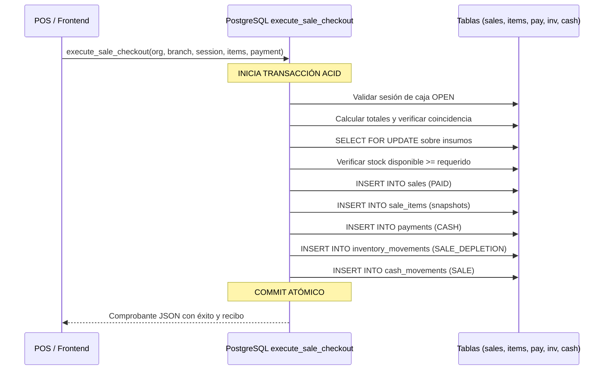

# ARBO OS — FASE 3: LÍMITE TRANSACCIONAL ACID & RPC

---

## 1. EL RIESGO DE MÚLTIPLES MUTACIONES EN EL FRONTEND

Un antipatrón clásico en sistemas de punto de venta web consiste en ejecutar una secuencia de mutaciones independientes desde React:
1. `supabase.from('sales').insert(...)`
2. `supabase.from('sale_items').insert(...)`
3. `supabase.from('payments').insert(...)`
4. `supabase.from('inventory_movements').insert(...)`
5. `supabase.from('cash_movements').insert(...)`

Si la conexión se interrumpe en el paso 3 o 4:
- El cliente tiene una venta registrada pero el stock físico jamás se descontó.
- O el dinero ingresó pero la caja no tiene movimiento.
- Esto destruye el balance contable y físico de la operación.

---

## 2. LA SOLUCIÓN: TRANSACCIÓN ACID INDIVISIBLE (RPC EN POSTGRESQL)

ARBO OS resuelve esto mediante la función almacenada `public.execute_sale_checkout(...)`:

Si **cualquier paso falla** (ej. `INSUFFICIENT_STOCK`, `PAYMENT_TOTAL_MISMATCH`, `CASH_SESSION_NOT_OPEN`):
- PostgreSQL dispara un `RAISE EXCEPTION`.
- El motor de base de datos aborta y ejecuta **ROLLBACK AUTOMÁTICO AL 100%**.
- No queda ningún registro huérfano en ninguna de las 5 tablas afectadas.
