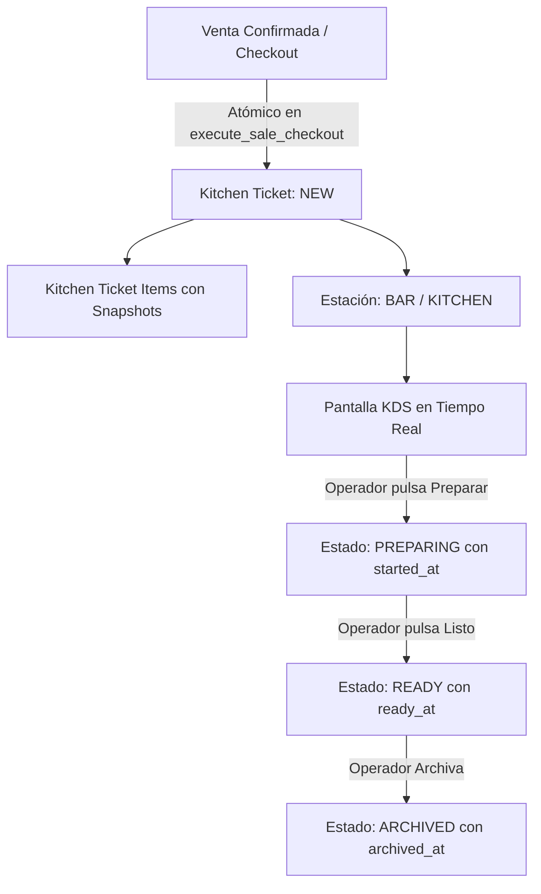

# ARBO OS — FASE 4: PLAN TÉCNICO DE KDS, COMANDAS Y ESTACIONES

**Fecha:** 2026-09-19  
**Estado:** IMPLEMENTADO Y VALIDADO 100%  
**Alcance:** KDS Realtime + Comandas Persistentes + Estaciones Operativas + Sincronización Fallback

---

## 1. OBJETIVO DE LA FASE 4

Construir la capa operativa de cocina y despacho (KDS) de ARBO OS, garantizando:
1. **Origen Transaccional de la Comanda:** Toda comanda KDS nace de una venta real (`sales`), garantizando que no exista una venta cobrada (`PAID`) sin su comanda correspondiente en cocina.
2. **Estaciones de Producción:** Soporte multi-estación (`kitchen_stations`) por sucursal (ej. Barra / Cafetería, Cocina Caliente, Postres).
3. **Ciclo de Vida Operativo:** Estados formales `NEW` $\rightarrow$ `PREPARING` $\rightarrow$ `READY` $\rightarrow$ `ARCHIVED` (y `CANCELLED` para auditoría de excepciones).
4. **Transporte Reactivo y Fallback Resiliente:** Supabase Realtime para actualización instantánea sin recarga de pantalla, asistido por un mecanismo de polling periódico (5s) con deduplicación por ID.
5. **Aislamiento Multi-Tenant (RLS):** 100% de las tablas protegidas contra accesos cruzados.

---

## 2. ARQUITECTURA DEL FLUJO OPERACIONAL

---

## 3. LÍMITES ESTRICTOS DE ALCANCE

- **NO** se implementa fidelización / ARBO Club.
- **NO** se implementa facturación AFIP / ARCA ni CAE.
- **NO** se implementa CRM ni marketing.
- **NO** se implementa delivery ni online ordering.
- **NO** se conectan impresoras térmicas ESC/POS físicas (simulado en comanda/software).
- **NO** se avanza automáticamente a Fase 5.
