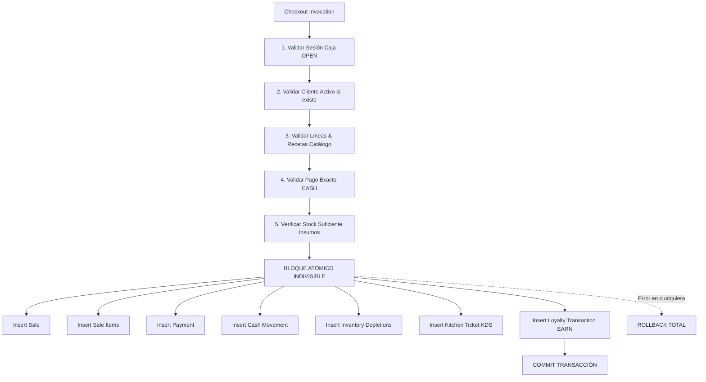

# ARBO OS — FASE 5: INTEGRACIÓN CON CHECKOUT TRANSACCIONAL ACID
## SALE + PAYMENT + INVENTORY + CASH + KDS + LOYALTY EARN

---

## 1. PRINCIPIO TRANSACCIONAL: TRANSACCIÓN INDIVISIBLE

La acreditación de puntos ARBO Club **NO se delega al frontend** mediante llamadas REST encadenadas. Una arquitectura que primero cobra la venta y luego intenta sumar puntos mediante una segunda petición HTTP es propensa a fallas de red, pérdida de puntos o discrepancias.

En ARBO OS, la acreditación de fidelización es un **sub-paso obligatorio y atómico** dentro del motor transaccional `execute_sale_checkout(...)`:



---

## 2. INTEGRACIÓN EN `execute_sale_checkout(...)`

En la función de checkout, si `p_customer_id` no es nulo:

1. **Bloqueo y Validación de Cliente**:
   ```sql
   IF p_customer_id IS NOT NULL THEN
       SELECT status INTO v_customer_status
       FROM public.customers
       WHERE id = p_customer_id AND organization_id = p_organization_id
       FOR UPDATE;

       IF NOT FOUND THEN
           RAISE EXCEPTION 'CUSTOMER_NOT_FOUND: El cliente no pertenece a la organizacion.';
       END IF;
       IF v_customer_status <> 'ACTIVE' THEN
           RAISE EXCEPTION 'CUSTOMER_INACTIVE: El cliente seleccionado no esta activo.';
       END IF;
   END IF;
   ```

2. **Cálculo y Acreditación de Puntos**:
   ```sql
   v_points_earned := FLOOR(v_total / 100);

   IF p_customer_id IS NOT NULL AND v_points_earned > 0 THEN
       INSERT INTO public.loyalty_transactions (
           id, organization_id, customer_id, branch_id, points_delta,
           transaction_type, reference_type, reference_id, notes, created_at
       ) VALUES (
           gen_random_uuid(), p_organization_id, p_customer_id, p_branch_id, v_points_earned,
           'EARN', 'SALE', v_sale_id::text,
           'Acumulacion ARBO Club por venta #' || v_sale_number || ' ($' || v_total || ')',
           timezone('utc'::text, now())
       );
   END IF;
   ```

---

## 3. GARANTÍA DE ROLLBACK BIDIRECCIONAL

- **Escenario de Error**: Si el cliente no existe, está inactivo, o se viola una restricción del ledger:
  - NO se crea la venta.
  - NO se asienta el pago en caja.
  - NO se consumen ingredientes del inventario.
  - NO se envía la comanda al KDS.
  - NO se acumulan puntos huérfanos.
- **Toda la operación se revierte (ROLLBACK)** de forma atómica.
