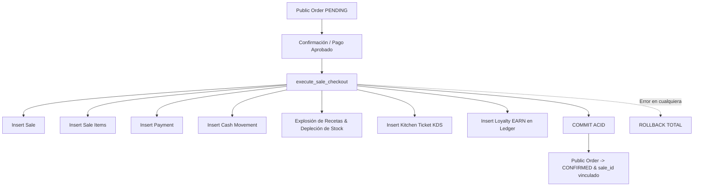

# ARBO OS — FASE 6: TRANSACCIÓN ACID: PUBLIC ORDER → SALE
## CONVERSIÓN INDIVISIBLE AL NÚCLEO OPERATIVO

---

## 1. PRINCIPIO: NUNCA DUPLICAR EL MOTOR TRANSACCIONAL

En lugar de crear una segunda rutina de inserción de ventas para pedidos web, ARBO OS integra los pedidos públicos directamente en el motor transaccional indivisible existente: `execute_sale_checkout(...)` / `executeSaleCheckoutAtomic`.

---

## 2. GARANTÍAS ACID CERTIFICADAS

1. **Atomicidad Absoluta**:
   - Venta + Pago + Inventario + Caja + KDS + Loyalty se ejecutan o revierten como una sola unidad.
2. **Consistencia de Inventario**:
   - Si no hay suficiente café en grano para el pedido online, la transacción falla con `INSUFFICIENT_STOCK`, evitando vender stock inexistente.
3. **Idempotencia de Confirmación**:
   - Una orden pública sólo puede confirmarse una vez. Intentos subsecuentes detectan `status !== 'PENDING'` y rechazan la duplicación.
