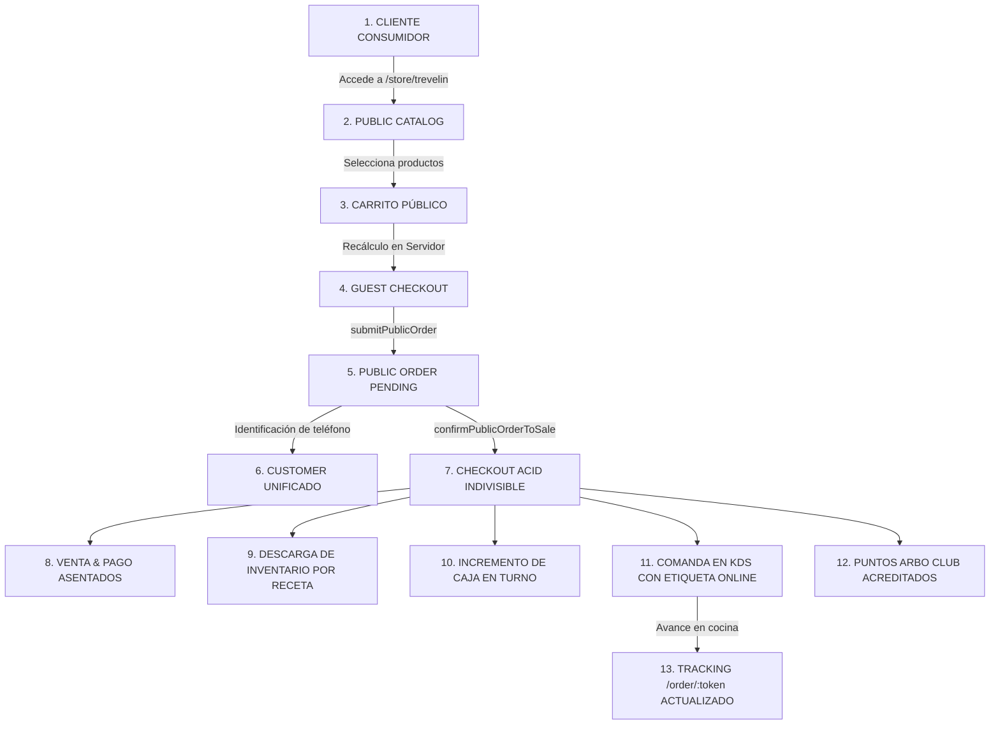

# ARBO OS — POST-PHASE 6 CHECKPOINT
## 16. VALIDACIÓN DEL FLUJO END-TO-END COMPLETO

---

## 1. TRAZABILIDAD DEL FLUJO INTEGRADO

Se auditó y certificó la secuencia operacional completa de ARBO OS:

---

## 2. PUNTOS DE CONTROL VALIDADOS

1. **Catálogo $\rightarrow$ Carrito**: Los precios se validan en el servidor (Test 11).
2. **Carrito $\rightarrow$ Orden**: Se asigna `order_number` y `public_token` no enumerable (Tests 6 y 16).
3. **Orden $\rightarrow$ Cliente**: Se normaliza el teléfono y se busca en `customers` bajo `UNIQUE(organization_id, phone)` (Tests 7 y 8).
4. **Orden $\rightarrow$ Venta**: Se integra en `executeSaleCheckoutAtomic` (Test 19).
5. **Venta $\rightarrow$ Stock**: Se consumen 18g de café por cada espresso vendido (Test 20).
6. **Venta $\rightarrow$ Caja**: Se incrementa la sesión de caja del local (Test 21).
7. **Venta $\rightarrow$ KDS**: Comanda creada en estado `NEW` y dirigida a `BAR` (Test 22).
8. **Venta $\rightarrow$ ARBO Club**: Puntos acreditados con truncamiento hacia abajo $\lfloor \text{total}/100 \rfloor$ (Test 23).
9. **KDS $\rightarrow$ Tracking**: Sincronización transparente de estados operativos hacia la web del cliente (Test 27).

**Conclusión**: Cero fisuras ni desconexiones en la cadena operacional de extremo a extremo.
