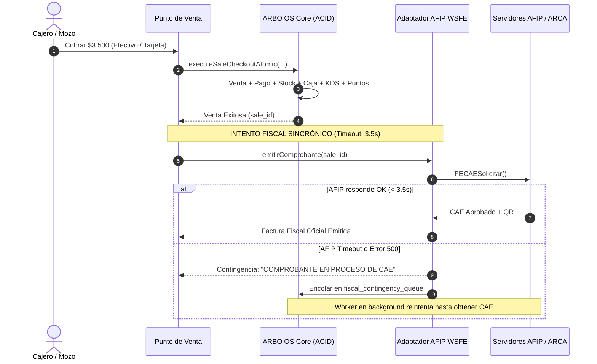

# ARBO OS — PRE-PHASE 7 CHECKPOINT
## 11. TRANSACCIONALIDAD & DESACOPLE FISCAL
## ¿AFIP DEBE BLOQUEAR LA TRANSACCIÓN DE VENTA?

---

## 1. ANÁLISIS DE LA FRONTERA ACID

Una decisión crítica en la arquitectura gastronómica es:
> **"Si los servidores de AFIP tardan 10 segundos o devuelven error 500, ¿la venta debe abortar y el comensal debe esperar sin poder pagar?"**

### Respuesta Arquitectónica de ARBO OS:
**NO.** La facturación fiscal se desacopla temporalmente de la venta operativa.

---

## 2. EL PROTOCOLO DE DOS FASES

### Ventajas Operativas:
1. El comensal paga y se retira en menos de 3 segundos sin demoras.
2. El salón nunca se congela por saturación de los servidores del Estado.
3. El restaurante cumple estrictamente con la obtención posterior del CAE según los plazos legales de contingencia fiscal de AFIP.
