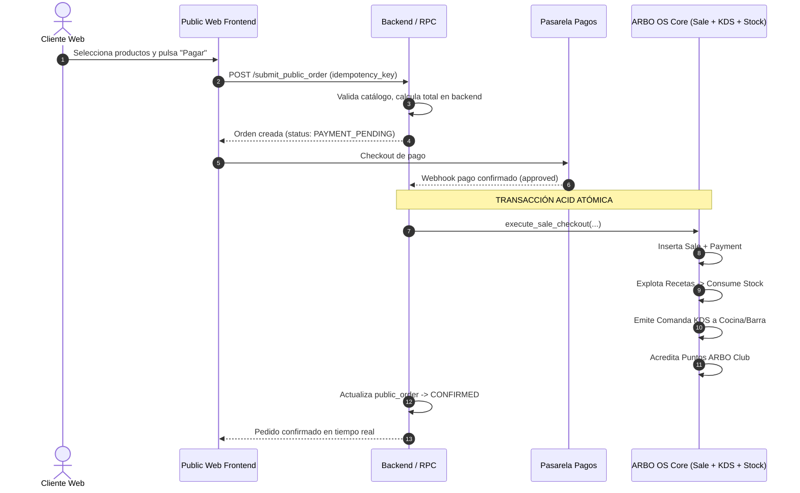

# ARBO OS — PRE-PUBLIC COMMERCE CHECKPOINT
## 04. ARQUITECTURA DEL MODELO DE ÓRDENES PÚBLICAS

---

## 1. ENTIDADES CONCEPTUALES REQUERIDAS PARA FASE 6

Para soportar la captación de pedidos desde la web sin contaminar inmediatamente el libro mayor contable y de caja con pedidos abandonados o no pagados, Fase 6 requerirá una entidad de buffer:

### 1. `public_orders`
- `id` (UUID clave primaria)
- `organization_id` (UUID del tenant)
- `branch_id` (UUID de la sucursal que preparará el pedido)
- `order_number` (Secuencial visible por el cliente, ej. #1042)
- `status`:
  - `SUBMITTED`: Pedido creado en el navegador, pendiente de pago o confirmación.
  - `PAYMENT_PENDING`: Esperando confirmación de pasarela de pago online.
  - `CONFIRMED`: Pago acreditado o pedido en efectivo confirmado por el local.
  - `IN_PREPARATION`: Comanda ingresada a KDS.
  - `READY`: Listo para retiro en mostrador o despacho.
  - `COMPLETED`: Entregado al cliente.
  - `CANCELLED`: Anulado por falta de pago o rechazo del local.
- `fulfillment_type`: `TAKEAWAY` (retiro en local), `DINE_IN` (pedido a la mesa / QR), `DELIVERY` (futuro).
- `customer_id` (UUID opcional hacia `customers`).
- `customer_name` (Texto obligatorio).
- `customer_phone` (Texto obligatorio para tracking e identidad).
- `customer_email` (Opcional).
- `subtotal`, `discount_amount`, `total`.
- `idempotency_key` (UUID único emitido por el cliente web).
- `external_payment_id` (Referencia del gateway de pago).
- `created_at`, `updated_at`.

### 2. `public_order_items`
- `id` (UUID)
- `public_order_id` (FK a `public_orders`)
- `product_id` (FK a `products`)
- `product_name_snapshot` (Nombre congelado al momento del pedido)
- `unit_price_snapshot` (Precio congelado validado en backend)
- `quantity` (Número entero positivo)
- `subtotal` (Línea calculada)
- `notes` (Instrucciones especiales, ej. "leche descremada, sin azúcar")

---

## 2. FRONTERA TRANSACCIONAL Y FLUJO HACIA `sales`

**Conclusión Fundamental**: Una orden pública **no es una venta fiscal/operativa** hasta que el pago está garantizado. La conversión a `sales` debe ocurrir de forma indivisible a través de la misma infraestructura transaccional de Fase 3 y Fase 4.
